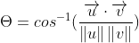

Install Dependencies:
playsound
OpenCV
Numpy
Mediapipe

\*Note Mediapipe requires Python version 3.6-3.8.

Landmarks:

For our basic squat detection, we are interested mainly in the angle formed at the knee, and we also want to ensure that the subject's feet do not leave the ground (eg. sitting in a chair and bending their knees would not be registered as squatting).

More complex implementations might take into consideration the alignment of the knees (does it still count as a squat if you stand with your heels together and bow your knees outwards?) or the positioning of the other body parts (do should arms be out horizontally or held to the back of the head? What is the proper range for the angle of the back?), but these constraints are outside the scope of this learning project.

Each landmark has (X,Y,Z) coordinates. If we consider the thigh and shin as two vectors with a common point at the knee, we can find the angle with the formula 

## Counting Repetitions

One rep consists of moving from a standing position, into a squat, and then back to standing.

These positions are defined by the angle formed at the knee - 0-15 degrees for standing, and 75-90 degrees for squatting.

In order to count as a rep, both knees must be registered within the angle range at the same time.
